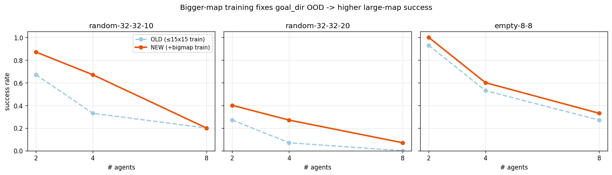

# MAPF Imitation Learning — 작업 로그

CBS(전문가)로 만든 데이터로 IL 정책(CNN)을 학습해, MAPF를 CBS보다 빠르게 푸는 것을 목표로 한 실험 기록.
상태 표준 v0.3: **5×5×3 local grid**(ch0 벽, ch1 다른 로봇, ch2 다른 agent 목표) **+ goal_dir 2**
(목표까지의 상대 [Δrow, Δcol]), action 5종(상·하·좌·우·대기).

---

## 핵심 결론

1. **CNN ≫ MLP**, 그리고 데이터 규모가 성능을 좌우 — held-out 정확도 0.76→0.83 (1.6k→13.7k 샘플).
2. **DAgger는 "교착"에서 효과** — 중간 혼잡(에이전트 4~6)에서 막힘을 풀어 성공률↑, 극혼잡(8+)엔 무효.
3. **대형맵 실패 원인 = goal_dir OOD** — 작은 맵만 학습해 먼 목표를 못 봄. 큰 맵 데이터 추가로 32×32 성공률 최대 2배.
4. **고혼잡은 dense 데이터로 부분 개선** — 대형맵(random-32-32-10 n8: 0.20→0.40)엔 도움, 소형 포화맵
   (empty-8-8)엔 무효. 데이터로는 한계 → DAgger/하이브리드 필요.
5. **CBS와 IL의 강점 구간이 분리** → 하이브리드 근거: CBS는 정확하나 어려울수록 시간이 폭발(타임아웃),
   IL은 항상 빠르나 밀집될수록 성공률이 떨어짐.

---

## 산출물 (전부 gitignore — 로컬/별도 공유)

**모델 `.pt`**
| 파일 | 학습 데이터 | 요점 |
|---|---|---|
| `mlp.pt` | 1.6k | MLP 베이스라인 (과적합, 열세) |
| `cnn.pt` | 1.6k | CNN 베이스라인 |
| `cnn_diverse.pt` | 13.7k | 데이터 확장 (BC 최고) |
| `cnn_dagger.pt` | +DAgger | 교착 회복 |
| `cnn_big.pt` | 27.7k (+큰맵) | 대형맵 개선 |
| `cnn_bigdense.pt` | 47k (+dense) | 고혼잡 실험 (진행) |

**데이터 `.npz`**: `real_v03`(303, held-out) / `_full`(1.6k) / `_combined`(13.7k) / `_big`(27.7k) / `_bigdense`(47k).
held-out = 학습에 안 쓴 별도 맵 세트(자체 6맵). 표준 벤치마크 평가는 MovingAI(`empty-8-8`, `random-32-32-*` 등) 사용.

---

## 실험 결과

### 1. BC — CNN vs MLP, 데이터 규모
held-out acc(= 학습 안 쓴 맵에서 action이 CBS와 일치하는 비율, 무작위 0.20):

| 모델 (학습 샘플) | held-out acc |
|---|---|
| MLP (1.6k) | 0.70 (60ep에선 과적합으로 0.61까지 하락) |
| CNN (1.6k) | 0.76 |
| CNN (13.7k) | **0.83** |

- MLP은 grid를 flatten해 공간구조를 못 살리고 금방 외움 → **주력은 CNN**.
- 데이터 7.4배(1.6k→13.7k)가 모든 방향 액션 정확도를 끌어올림.
- 에폭: MLP 12~15(early stop), CNN 50~55 권장.

### 2. DAgger — 교착(deadlock) 회복
성공률 = 정책을 굴려 **전원이 충돌 없이 목표 도달**한 비율. 교착 = 실패 중 마지막 12스텝 진전 없이 멈춘 것.
(empty-8-8, 25 인스턴스)

| 에이전트 | 교착률 BC→DAgger | 성공률 BC→DAgger |
|---|---|---|
| 4 | 0.44 → 0.32 | 0.56 → 0.68 |
| 6 | 0.60 → **0.36** | 0.40 → **0.64** |
| 8 | 0.68 → 0.76 | 0.32 → 0.24 |

- **중간 혼잡(4~6)에서 DAgger가 교착을 실제로 풀어 성공률↑**. 극혼잡(8, 8×8에 8명)은 맵이 포화돼 무효.
- held-out acc는 DAgger 후 오히려 소폭↓(0.83→0.80) — held-out은 전문가 궤적 정확도라 DAgger의 롤아웃-회복
  효과와 지표가 다름. 판정은 성공률/교착률로.

### 3. 대형맵 — goal_dir OOD 진단·해결
모델은 5×5 FOV만 보고 전역 정보는 goal_dir 하나. 학습 맵이 ≤15×15라 goal_dir 성분이 최대 14(92%는 ≤7)에
머물렀는데, 32×32는 최대 31까지 필요 → **학습서 못 본 범위(OOD)**. 그래서 혼잡하지 않은 2명짜리도 대형맵에서 실패.
→ **큰 맵(16~32)+소수 에이전트** 데이터를 추가(goal_dir 범위 14→31) 후 재학습.

성공률 (cnn_diverse → cnn_big):
| map:agents | OLD | NEW |
|---|---|---|
| random-32-32-10 : 2 | 0.67 | 0.87 |
| random-32-32-10 : 4 | 0.33 | **0.67** |
| random-32-32-20 : 4 | 0.07 | 0.27 |
| random-32-32-*  : 8 | 0.20/0.00 | 0.20/0.07 |

- goal_dir 공백을 메우자 **저~중밀도 대형맵 성공률 최대 2배**. 단 **고혼잡(8+)은 정체** — 이건 goal_dir가 아닌
  교착 문제.

**고혼잡 추가 실험(dense 데이터, `cnn_bigdense`)**: 소형·중형 맵에 다수 에이전트(6~8) 데이터를 대량 추가.
결과는 map 의존적 — random-32-32-10 n8은 성공률 0.20→0.40(교착 0.73→0.53)로 개선, empty-8-8은 무효.
**8명이 8×8에 몰리면 반응형 로컬 정책의 근본 한계**라 BC 데이터로는 안 풀림 → DAgger(상호작용)나 하이브리드 필요.

### 4. CBS vs IL — 하이브리드 근거
같은 벤치마크 인스턴스를 CBS와 IL로 각각 풀어 성공률/실행시간/해품질(makespan) 비교. 밀도 0~35% × 에이전트 2~16.

| 맵 (밀도) | 에이전트 | CBS 성공/시간 | IL 성공/시간 |
|---|---|---|---|
| empty-8-8 (0%) | 2 | 1.00 / 0.09s | 0.92 / **0.015s** |
| random-32-32-20 (20%) | 8 | **1.00** / 1.3s | 0.00 / 0.5s |
| random-32-32-20 (20%) | 16 | 0.08 / **9.6s** | 0.00 / 0.9s |
| maze-32-32-2 (35%) | 8 | **0.00 / timeout** | 0.00 / 0.5s |

- **CBS**: 최적(makespan 최소)이지만 어려울수록 시간이 지수적으로 늘어 timeout(성공률 0). **IL**: 항상 <1s로
  평탄, 쉬운 구간에선 CBS와 동일 품질이나 밀집서 성공률↓.
- 강점 구간이 갈림 → **IL을 빠른 1차 시도로, 실패/충돌 시 그 부분만 CBS로 재해결**하는 하이브리드가 유망.

---

## 재현 (스크립트)

| 스크립트 | 역할 |
|---|---|
| `spec.py` | v0.3 표준 상수·검증. **표준 바뀌면 여기만 수정** |
| `train.py --mode cnn --npz <data>` | BC 학습 |
| `scripts/run_cbs_batch.py` | 시나리오 폴더 → CBS 라벨(per-scenario npz) |
| `scripts/build_il_smoke_dataset.py` | per-scenario npz → 하나로 병합 |
| `scripts/build_{diverse,bigmap,dense}_scenarios.py` | 목적별 시나리오 생성 |
| `scripts/train_dagger.py` | DAgger 학습 (시뮬레이터 필요) |
| `scripts/eval_movingai_benchmark.py` | 표준 벤치마크 action-acc + success-rate |
| `scripts/eval_cbs_vs_il.py` | CBS vs IL 정면 비교 |
| `scripts/eval_deadlock.py` | 교착률 계측 |

DAgger·롤아웃 평가는 시뮬레이터 팀의 `MAPFStepSimulator`(`simulator.py`) 사용.

---

## 주의사항 (working-level gotchas)

- **Python은 `py` 런처로 실행**. `python`은 Windows Store 스텁이라 먹통.
- 콘솔 한글 깨지면 `$env:PYTHONIOENCODING="utf-8"`.
- **v0.3 채널 의미가 바뀌면 기존 `.npz`/`.pt` 재생성 필수** — shape이 같아 에러 없이 로드되지만 조용히 틀림.
- **CBS는 maze·dense·다수 에이전트(대형맵 8+)에서 타임아웃** — 데이터 생성/롤아웃 시 이 조합은 피하거나
  시간 캡. (하이브리드가 필요한 바로 그 구간)
- MovingAI 파일은 묶음 zip(`mapf-map.zip`, `mapf-scen-random.zip`)으로 받는다(개별 URL은 메뉴 페이지 반환).

---

## TODO

- [x] 고혼잡 dense 데이터 실험 — 대형맵만 부분 개선, 소형 포화맵은 근본 한계 확인
- [ ] DAgger를 대형·다수 에이전트 분포로 확장 (현재는 소형 쉬운 맵으로 제한) — 고혼잡의 유력한 다음 카드
- [ ] 하이브리드 프로토타입 (고혼잡·포화 구간 대응)
- [ ] 하이브리드 프로토타입: IL 1차 + 실패/충돌 시 국소 CBS
- [ ] `train.py` best-val 체크포인트 저장 (현재 마지막 에폭만 저장 → MLP 과적합 회피)
