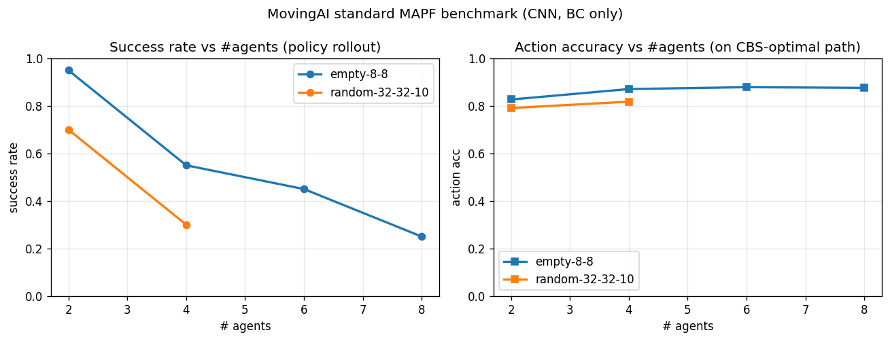
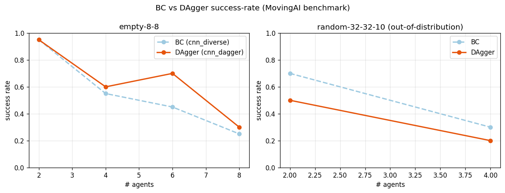
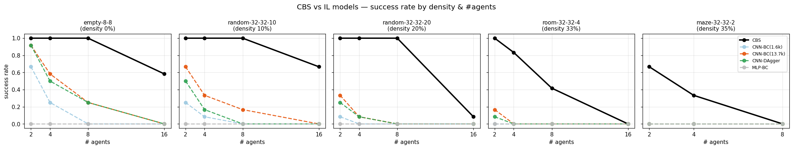
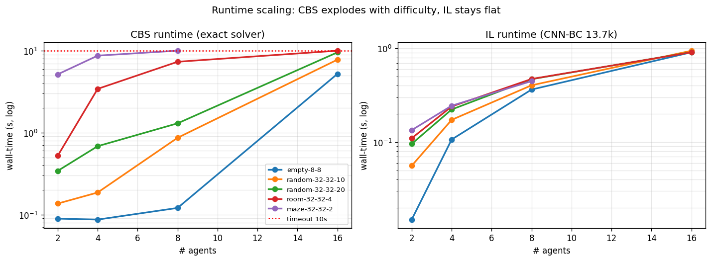
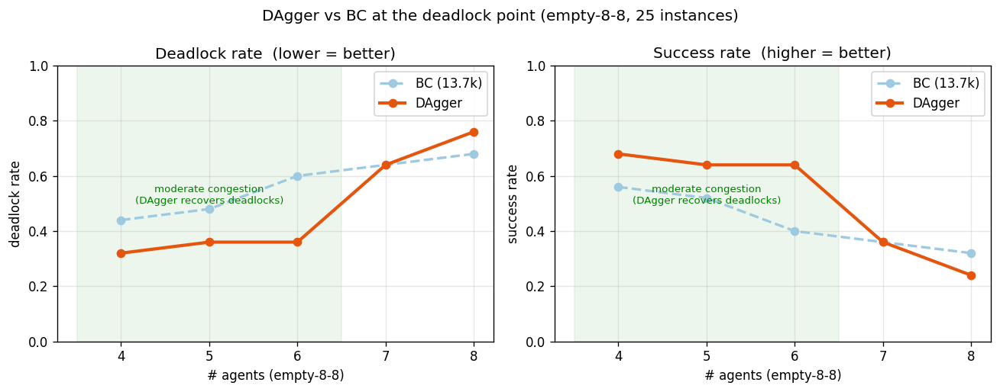
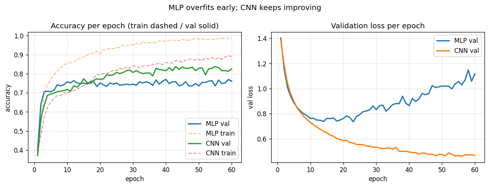
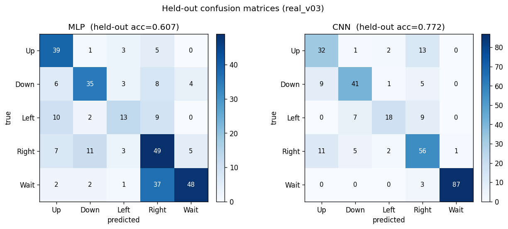
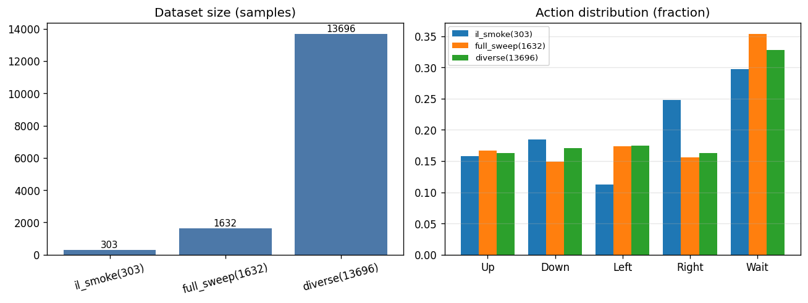
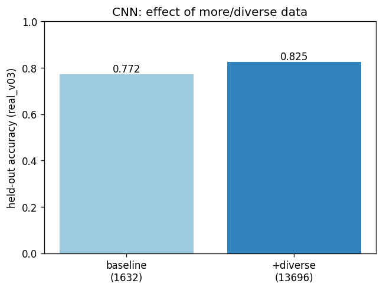

# IL 파이프라인 작업 로그 — 2026-07-06

Track 2 (Imitation Learning) v0.3 기준. BC 학습·평가, 에폭 분석, CBS 데이터 재생성/다양화 과정 및
그 과정에서 발생한 오류와 해결을 정리한다. (보고서 초안용 원자료)

> 표준 v0.3 요약은 [HANDOFF.md](../HANDOFF.md), 채널 재설계 배경은
> [channel_spec_v0.3_notes.md](../channel_spec_v0.3_notes.md), DAgger 시뮬레이터 요청은
> [simulator_abc_request.md](simulator_abc_request.md) 참고.

---

## 0. 이 세션의 목표

1. 원격(GitHub) 최신 변경을 로컬로 반영
2. v0.3 채널 재설계에 맞춰 산출물 재생성 후 BC(MLP/CNN) 학습·평가
3. 성능 분석 + 에폭·데이터 규모/다양성이 성능에 주는 영향 파악
4. 실데이터를 직접 새로 생성(맵→CBS→데이터셋)하고 데이터 다양화

---

## 1. 실행 환경

| 항목 | 값 | 비고 |
|---|---|---|
| OS | Windows 11 | 기본 셸 PowerShell |
| Python | 3.12.6 | **`py` 런처로 실행** (아래 오류 A 참고) |
| PyTorch | 2.6.0+cu124 | CUDA 사용 가능 |
| numpy | 2.2.6 | |
| PyYAML | 6.0.3 | CBS 어댑터가 사용 |
| GPU | 8GB급 (CUDA) | 학습 시에만 사용. CBS 배치는 **CPU 전용** |

**자원 사용 구분 (중요):**
- **CBS 배치(데이터 생성)** = CPU 탐색 알고리즘. GPU 미사용. 실제 병목은 여기.
- **MLP/CNN 학습·평가** = GPU(CUDA). 모델이 작아(3만~5만 params) 몇 초 내 완료.

---

## 1-1. 지표·라벨 정의 (Glossary) — 결과표 읽는 법

### action 라벨 (5-클래스 분류)
모델은 각 상태에서 **다음 한 칸 이동**을 5개 중 하나로 분류한다 (`spec.py` v0.3 표준).

| id | 라벨 | 영문 | 이동 (Δrow, Δcol) |
|---|---|---|---|
| 0 | 상 | Up | (-1, 0) |
| 1 | 하 | Down | (+1, 0) |
| 2 | 좌 | Left | (0, -1) |
| 3 | 우 | Right | (0, +1) |
| 4 | 대기 | Wait | (0, 0) |

> **결과표의 `상 / 하 / 좌 / 우 / 대기` 열 = 그 액션 하나에 대한 per-action F1 점수다.**
> 예: "좌 F1 = 0.656"은 "좌(Left) 이동을 얼마나 정확히 예측하는가"를 나타낸다. 낮을수록 그 방향을
> 자주 틀린다는 뜻(우리 모델은 좌 방향이 최약점).

### 지표 정의

| 지표 | 정의 | 해석 |
|---|---|---|
| **accuracy** | 예측 action == 정답(CBS) action 인 샘플 비율 | 5-클래스라 무작위 = 0.20 |
| **val acc** | 학습셋에서 떼어낸 검증분할(20%)의 accuracy | 같은 분포 → 다소 낙관적 |
| **held-out acc** | 학습셋과 **완전히 disjoint한 별도 셋**의 accuracy | **진짜 일반화 성능** |
| **precision** (액션별) | 그 액션이라 **예측한 것 중** 실제로 맞은 비율 | 오탐(FP) 적을수록 ↑ |
| **recall** (액션별) | 그 액션인 **정답 중** 맞게 예측한 비율 | 누락(FN) 적을수록 ↑ |
| **F1** (액션별) | precision·recall의 조화평균 | 둘의 균형. 표의 상/하/좌/우/대기 열 |
| **macro-F1** | 5개 액션 F1의 **단순 평균** | 드문 액션(대기 등)도 동등 반영 → 편향 감지 |
| **confusion matrix** | 행=정답, 열=예측 인 5×5 표 | 어떤 액션을 어떤 액션으로 헷갈리는지 |
| **action-accuracy** (벤치마크) | CBS 최적경로를 따라가며 **매 스텝** 전문가와 같은 선택을 한 비율 | per-step 모방 정확도 |
| **success-rate** (벤치마크) | 정책을 굴려 **전원이 충돌 없이 목표 도달**한 인스턴스 비율 | **MAPF 논문 표준 지표** |

> **왜 지표가 여러 개인가**: `accuracy`만 보면 흔한 액션(대기)에 편향돼도 높게 나올 수 있다.
> 그래서 `macro-F1`(액션 균형)과 `per-action F1`(약점 방향 식별)을 같이 본다. 그리고 per-step
> `action-accuracy`가 높아도 실제로 **끝까지 목표에 도달하느냐**는 `success-rate`로 따로 봐야 한다
> (매 스텝 소오차가 롤아웃에서 누적되기 때문 — §2-10 참고).

---

## 2. 진행 과정 (시간순)

### 2-1. GitHub 동기화
- 로컬 `IL` 브랜치 == `origin/IL` (0 ahead / 0 behind) — IL 자체는 새로 받을 커밋 없음.
- 원격에서 갱신된 브랜치: `main`, `feature/map-generator`, `test-cbs-adapter-map-generator`.
- Track 1 파일(`src/*`)은 HANDOFF 정책상 IL 브랜치에 커밋하지 않고 로컬 실행용으로만 둠(untracked).
- 원격과 실제로 내용이 다른 유일 파일: **`src/cbs_adapter.py`** — CBS 타임아웃 기본값 **30s → 90s**
  (`DEFAULT_CBS_TIMEOUT_SEC = 90` 상수 도입). 최신 버전을 로컬로 가져옴.
- 나머지 `src/*`는 v0.3 채널이 이미 반영됨(로컬==원격, 줄바꿈 차이뿐).

### 2-2. v0.3 산출물 재생성
- v0.3에서 grid 채널 **의미**가 바뀜(shape은 그대로 `(N,3,5,5)`). 기존 v0.2 산출물은
  shape이 같아 에러 없이 로드되지만 **조용히 틀린 데이터로 학습**되는 위험 → 반드시 재생성.
- 기존 `dummy_v02.npz`, `mlp.pt`, `cnn.pt` 삭제 후 `py spec.py`로 v0.3 더미(N=2000) 재생성 + 검증 통과.

### 2-3. BC 학습 — 더미(파이프라인 무결성 확인용)
| 모델 | val acc | eval acc | 대기(4) F1 |
|---|---|---|---|
| MLP | 0.772 | 0.877 | **0.000** |
| CNN | 0.860 | 0.877 | **0.000** |

- 대기 F1=0.000은 **더미 라벨 생성기 편향**(대기를 노이즈로만 넣음) 때문. 실데이터에선 정상(아래).

### 2-4. 실데이터 확인
| 파일 | = 출처 | N | action 분포(상하좌우대기) |
|---|---|---|---|
| `real_v03.npz` | `il_smoke_v0_3` | 303 | [48, 56, 34, 75, 90] |
| `real_v03_full.npz` | `full_sweep` | 1632 | [273, 244, 283, 254, 578] |

- 두 세트의 `scenario_id`가 **완전 disjoint**(303=기본 6맵 / 1632=45조합) → 1632로 학습, 303으로
  평가하면 **진짜 일반화(held-out) 성능** 측정 가능.
- `full_sweep`은 45조합 중 **38 성공 / 7 실패**(모두 CBS 타임아웃, 그중 6개가 maze).

### 2-5. 실데이터 BC 학습·평가
학습=`real_v03_full`(1632), held-out 평가=`real_v03`(303).

| 모델 | 20에폭 val | held-out acc | held-out macro-F1 | 대기 F1 |
|---|---|---|---|---|
| MLP | 0.752 | 0.703 | 0.683 | 0.836 |
| CNN | 0.770 | **0.762** | **0.733** | **0.951** |

- 실데이터에선 대기 F1 정상화(더미 편향 가설 확인). CNN이 전 지표 우세.

### 2-6. 에폭 분석 (60에폭으로 확장)
| 모델 | 내부 val 추이 | held-out 20ep → 60ep |
|---|---|---|
| MLP | ep10~15 포화 후 val loss만 상승(과적합) | 0.703 → **0.607 (악화)** |
| CNN | ep55까지 val loss 계속 하락, val acc 0.837 | 0.762 → **0.772 (개선)** |

- **MLP: 12~15에폭 + early stopping 권장** (더 늘리면 손해).
- **CNN: 50~55에폭 권장** (아직 완만히 상승 중 → 데이터 늘면 더 길게 가능).
- 개선점: `train.py`가 현재 **마지막 에폭만 저장** → best-val 체크포인트 저장 로직 추가 시 MLP 과적합 자동 회피.

### 2-7. CBS 실패/타임아웃 분석
- `full_sweep`의 7개 실패 = **전부 CBS 타임아웃(45s)**, 6개가 `maze`, 나머지 `dense_s15_n5`, `rooms_s11_n5`.
- 실패는 **n5(에이전트 5)·maze·대형 맵**에 집중.
- 검증 실험: 동일 45개를 **timeout 90s**로 재실행 → `dense_s15_n5`는 **90초로도 실패**.
  → **타임아웃 증가만으로 maze/대형-n5는 회수 안 됨(구조적 한계)**.

### 2-8. 데이터 다양화 (이번 핵심)
- 문제의식: 현재 CNN 약점이 **좌/우 방향 혼동**(좌 F1 0.63, 우 0.70) → 레이아웃 다양성 부족으로 추정.
- 기존 `map_generator.build_dataset`은 (지형×크기×에이전트) 조합당 **seed 1개**만 생성(45개).
- 신규 스크립트 **`scripts/build_diverse_scenarios.py`** 작성: 조합당 seed 여러 개를 뽑아 배치/벽배열
  다변화. 예산은 CBS 난이도에 맞춰 배분(잘 풀리는 조합에 집중).
- 결과: **332개 시나리오 생성**(empty/sparse 각 90, dense/rooms 각 70, maze 12).
- CBS 배치(timeout 30) 완료: **316 성공 / 16 실패**(성공률 95%). maze를 쉬운 조합으로 제한해 maze 실패 1개뿐.
- 병합 결과: diverse **12,064 샘플**. 기존 `real_v03_full`(1,632)과 합쳐 **`real_v03_combined.npz` = 13,696 샘플**
  (held-out `real_v03`과 겹침 없음 확인).
- **확장 효과 (CNN, held-out `real_v03`)**:

  | 지표 | baseline 1,632 | combined 13,696 |
  |---|---|---|
  | accuracy | 0.772 | **0.825** (+0.053) |
  | macro-F1 | 0.738 | **0.789** |
  | 상 F1 | 0.640 | 0.739 |
  | 우 F1 | 0.696 | 0.810 |
  | 좌 F1 | 0.632 | 0.656 |
  | 대기 F1 | 0.978 | 0.983 |

  → 데이터 7.4배 + 방향 액션 균형화로 **모든 액션 개선**. 특히 우/상 혼동 크게 완화, 좌는 여전히 최약점.

### 2-9. 시뮬레이터 도착 & DAgger 검증
- 시뮬레이터 팀이 `origin/feature/simulator`(커밋 `8c4ac1a`)에 **`MAPFStepSimulator(MAPFSimulator)`**를
  구현해 올림 — 우리가 요청했던 `reset`/`step`/`get_expert_actions` ABC. v0.3 채널·goal_dir·충돌처리
  (벽/맵밖=제자리, vertex/edge collision=제자리) 모두 규격대로.
- 로컬 스모크 검증 통과: obs 포맷 `(3,5,5)+(2,)`, 전문가 롤아웃 전원 목표 도달, **DAgger collect+train 1-iter 정상**.
- → **DAgger 및 정책 롤아웃(성공률) 평가가 열림.**

### 2-10. 표준 MAPF 벤치마크 평가 (MovingAI)
- 기존 평가셋(`real_v03`)이 자체 합성맵이라, **MovingAI(Sturtevant) 표준 벤치마크**로 추가 평가.
- 전체 맵 33개 + 시나리오 묶음 다운로드, `.map`/`.scen` 파서 작성(`scripts/eval_movingai_benchmark.py`).
- 두 지표: ① CBS-최적경로 위 **action-accuracy**, ② 정책 롤아웃 **success-rate**(전원 목표·무충돌, 논문 지표).

  | 맵 | 에이전트 | action-acc | success-rate |
  |---|---|---|---|
  | empty-8-8 | 2 | 0.827 | **0.950** |
  | empty-8-8 | 4 | 0.871 | 0.550 |
  | empty-8-8 | 6 | 0.879 | 0.450 |
  | empty-8-8 | 8 | 0.876 | **0.250** |
  | random-32-32-10 | 2 | 0.791 | 0.700 |
  | random-32-32-10 | 4 | 0.818 | 0.300 |

- **핵심 관찰**: per-step action-acc는 ~0.8~0.88로 높은데, **에이전트 수가 늘면 success-rate가 급락**
  (empty-8-8: 0.95→0.25). BC의 전형적 한계 — 매 스텝 소오차가 롤아웃에서 누적돼 충돌/교착 발생.
  **DAgger가 필요한 이유를 표준 벤치마크로 입증.** 미학습 대형 맵(32×32)에도 action-acc가 유지돼
  per-step 일반화는 양호.

### 2-11. DAgger 학습 & BC 대비 성능 (2026-07-07)
- `cnn_diverse.pt`(BC)를 시작점으로 **DAgger 15 iteration** 실행(`scripts/train_dagger.py`).
  매 스텝 CBS 재라벨, 정책 롤아웃 상태를 누적 학습. 17.6분, 누적 23,639샘플.
- **CBS-solvable 쉬운 시나리오만**(empty/sparse/rooms, size ≤11, 에이전트 ≤3) 사용 + **CBS 타임아웃 10초 캡**.
  (첫 시도는 전체 풀 랜덤 사용 → 중간 상태에서 CBS가 90초까지 걸려 1 iteration에 30분 이상 → 오류 H 참고.)
- held-out action-acc: 0.825 → 0.799 (**소폭 하락**). 단 held-out은 *전문가 궤적 위* 정확도라
  DAgger의 이득(롤아웃 회복)과는 다른 지표 → **표준 벤치마크 success-rate로 판정**.

  | 맵 | 에이전트 | BC success | DAgger success | 변화 |
  |---|---|---|---|---|
  | empty-8-8 | 2 | 0.95 | 0.95 | = |
  | empty-8-8 | 4 | 0.55 | 0.60 | +0.05 |
  | empty-8-8 | 6 | 0.45 | **0.70** | **+0.25** |
  | empty-8-8 | 8 | 0.25 | 0.30 | +0.05 |
  | random-32-32-10 | 2 | 0.70 | 0.50 | −0.20 |
  | random-32-32-10 | 4 | 0.30 | 0.20 | −0.10 |

- **혼합 결과**: 학습 분포에 가까운 **empty-8-8(소형·개방)에서 다중 에이전트 성공률 개선**(6명 +0.25)으로
  DAgger 효과 입증. 반면 **미학습 대형맵 random-32-32-10에서는 하락**.
- **원인**: 속도를 위해 DAgger 풀을 소형·소수에이전트로 좁힌 탓에 대형맵 일반화가 약해짐 +
  random-32-32-10 인스턴스 10개라 노이즈 큼 + 저장 모델이 best-iteration이 아닌 마지막 iteration.
- **결론**: DAgger 자체는 효과적이나 **학습 시나리오 다양성이 일반화를 좌우**. 다음은 풀 확대(대형맵 포함)와
  best-iteration 체크포인트 선택.

### 2-12. CBS vs IL 정면 비교 — 하이브리드 근거 (2026-07-07)
프로젝트의 핵심 질문("CBS와 IL의 강점 구간이 달라 하이브리드가 가능한가")을 검증하기 위해,
**동일 벤치마크 인스턴스를 CBS와 모든 IL 모델로 각각 풀어** 3축(성공률/실행시간/makespan)을 비교
(`scripts/eval_cbs_vs_il.py`). 밀도 5종 × 에이전트 2~16 × 12 인스턴스. 학습·데이터 생성 없이 측정만.

**대표 수치 (CBS vs 최고 IL = CNN-BC 13.7k):**

| 맵 (밀도) | 에이전트 | CBS 성공/시간/mk | IL 성공/시간/mk |
|---|---|---|---|
| empty-8-8 (0%) | 2 | 1.00 / 0.09s / 6.3 | 0.92 / **0.015s** / 6.3 |
| empty-8-8 (0%) | 16 | 0.58 / **5.23s** / 9.1 | 0.00 / 0.91s / — |
| random-32-32-10 (10%) | 8 | 1.00 / 0.87s / 38 | 0.17 / 0.40s / 34 |
| random-32-32-20 (20%) | 8 | **1.00** / 1.30s / 37 | 0.00 / 0.47s / — |
| random-32-32-20 (20%) | 16 | 0.08 / **9.57s** / 35 | 0.00 / 0.91s / — |
| room-32-32-4 (33%) | 16 | **0.00 / 10.0s(timeout)** / — | 0.00 / 0.91s / — |
| maze-32-32-2 (35%) | 8 | **0.00 / 10.0s(timeout)** / — | 0.00 / 0.45s / — |

**모델 순위 (전 구간)**: MLP-BC는 롤아웃 성공률 사실상 0(전 구간). CNN-BC(1.6k) < **CNN-BC(13.7k) ≈ CNN-DAgger**.
즉 데이터 규모(1.6k→13.7k)가 IL 성공률을 크게 끌어올렸고, MLP는 롤아웃엔 부적합.

**핵심 관찰 (하이브리드 논거):**
1. **CBS = 정확(최적 makespan)·but 지수적으로 느려짐**: empty-8-8 시간 0.09s(n2)→5.23s(n16),
   random-32-32-20 0.34s(n2)→9.57s(n16), room/maze는 timeout(10s)으로 **성공률 0**.
2. **IL = 항상 <1s로 평탄·에이전트에 선형**: 품질도 쉬운 구간에선 CBS와 동일 makespan(near-optimal).
   단 밀집·다수에서 성공률 하락.
3. **강점 구간이 명확히 분리됨** → 하이브리드 근거:

   | 난이도 구간 | 승자 | 이유 |
   |---|---|---|
   | 저밀도·소수(open, 2~4) | **IL** | 둘 다 풀지만 IL이 6~10배 빠르고 품질 동등 |
   | 중밀도·중간(CBS still solves) | **CBS** | IL 성공률 하락, CBS는 아직 빠르고 최적 |
   | 고밀도·다수(16, maze/room) | **둘 다 실패** | CBS는 timeout(느리게 실패), IL은 즉시 실패 |

**결론 / 하이브리드 방향**: IL의 *평탄한 실행시간*이 CBS의 *지수적 폭발*을 보완하고, CBS의 *신뢰성/최적성*이
IL의 *성공률 공백*을 메운다. 따라서 **IL을 빠른 1차 시도로 쓰고, 실패/충돌이 감지되면 그 부분만 CBS로
재해결**(conflict 국소 CBS, 또는 IL warm-start → CBS repair)하는 하이브리드가 유망하다. 고난이도 구간(maze/
16-agent)은 둘 다 실패하므로 별도 과제.

### 2-13. 교착(deadlock) 지점에서의 DAgger — 가설 직접 검증 (2026-07-07)
당초 가설: "DAgger는 *교착 상태*(정책이 에이전트를 서로 막히게 만든 상태)에서 강할 것". §2-11·§2-12의
전체 성공률은 이걸 평균에 묻어버려 드러나지 않았다. 그래서 **혼잡 구간을 세분(에이전트 4~8)** 하고
롤아웃을 계측해 실패를 **교착(deadlock) vs 단순 시간초과**로 분리(`scripts/eval_deadlock.py`, empty-8-8,
25 인스턴스). 교착 정의 = 실패한 에피소드 중 **마지막 12스텝 동안 총 잔여거리(Σ|goal_dir|)가 전혀
줄지 않음**(에이전트가 얼어붙거나 진동).

| 에이전트 | 모델 | 성공률 | 도달%(부분) | **교착률** |
|---|---|---|---|---|
| 4 | BC(13.7k) | 0.56 | 0.83 | 0.44 |
| 4 | **DAgger** | **0.68** | 0.87 | **0.32** |
| 5 | BC(13.7k) | 0.52 | 0.80 | 0.48 |
| 5 | **DAgger** | **0.64** | 0.83 | **0.36** |
| 6 | BC(13.7k) | 0.40 | 0.76 | 0.60 |
| 6 | **DAgger** | **0.64** | 0.85 | **0.36** |
| 7 | BC(13.7k) | 0.36 | 0.77 | 0.64 |
| 7 | DAgger | 0.36 | 0.79 | 0.64 |
| 8 | BC(13.7k) | 0.32 | 0.78 | 0.68 |
| 8 | DAgger | 0.24 | 0.79 | 0.76 |

**결과 = 가설 확인(단, 조건부):**
- **중간 혼잡(n4~6)**: DAgger가 **교착률을 크게 낮춤**(n6 0.60→0.36) → 막힌 상황을 풀어 **성공률 상승**
  (n6 0.40→0.64). 이게 "DAgger가 교착에 강하다"의 직접 증거.
- **극혼잡(n7~8, 8×8에 8명)**: 맵이 포화돼 회복 여지 자체가 없어 **효과 소멸/역전**. 반응형 정책의 한계이며
  이 구간이야말로 §2-12의 하이브리드(국소 CBS 개입)가 필요한 지점.

> 왜 앞선 분석에서 안 보였나(트러블슈팅 J): 전체 성공률만 보면 교착 특화 이득이 평균에 희석되고,
> CBS-vs-IL 스윕은 에이전트를 2/4/8/16으로 띄엄띄엄 봐 교착 발생 구간(n5~6)을 건너뛰었다.

---

## 3. 발생한 오류와 해결 (트러블슈팅)

| # | 증상 | 원인 | 해결 |
|---|---|---|---|
| A | `python --version` 실행 시 "Python"만 출력 후 exit code 49, torch import 무반응 | `python`이 **Microsoft Store 스텁**(`WindowsApps\python.exe`)을 가리킴 — 실제 인터프리터 아님 | **`py` 런처 사용**(Python 3.12.6). 이후 모든 실행을 `py ...`로 통일 |
| B | 콘솔에 한글 출력이 `????`/모지바케로 깨짐 (예: spec.py, train.py 로그) | Windows 콘솔 기본 코드페이지가 UTF-8이 아님 | 실행 전 `$env:PYTHONIOENCODING="utf-8"` 설정. (프로그램 동작 자체는 정상이었고 출력 표시만 문제) |
| C | `git diff --stat origin/... -- src/`가 모든 파일을 "삭제"로 표시 | `src/*`가 **untracked**라 git이 인덱스 기준 비교 불가 | 오해였음. 파일 내용을 `git show <ref>:path`와 직접 diff해 확인 → 실제로는 줄바꿈(CRLF) 차이뿐 |
| D | 마크다운 문서가 GitHub에서 **일반 텍스트로** 표시됨 | push된 파일명 `simulater 수정사항`에 **`.md` 확장자 없음** (커밋 `c286608`) | 파일명에 `.md`를 붙임. GitHub은 `.md`/`.markdown`만 렌더링 |
| E | v0.2 산출물을 그대로 쓰면 학습이 "성공"하는데 결과가 이상할 위험 | v0.3에서 grid 채널 **의미**만 바뀌고 shape은 동일 → 에러 없이 로드되나 의미가 틀림 | 기존 `.npz`/`.pt` 전부 삭제 후 v0.3로 재생성 (조용한 오염 방지) |
| F | `full_sweep` 45개 중 7개 CBS 실패 | maze/n5/대형 맵에서 CBS 탐색이 타임아웃 | timeout 45→90 상향으로 일부 시도했으나 maze·대형-n5는 구조적으로 미해결 → 다양화 시 해당 조합 최소화로 우회 |
| G | MovingAI `.map` 직접 URL이 raw 대신 HTML 메뉴 반환, per-map 시나리오 zip은 404 | movingai.com은 파일을 묶음 zip으로 배포 | 전체 맵 `mapf-map.zip`, 시나리오 `mapf-scen-random.zip`를 받아 풀어서 사용 |
| H | DAgger 1 iteration이 30분 넘게 안 끝남(멈춘 듯) | `get_expert_actions`가 매 스텝 CBS 재호출 + 시뮬레이터 CBS 타임아웃 기본 90초 → 중간 상태가 어려우면 한 스텝에 수십 초 | 학습 풀을 CBS-solvable 쉬운 시나리오로 제한 + `MAPFStepSimulator`에 `cbs_timeout_sec` 인자 추가해 10초로 캡 + `py -u`로 실시간 로그 |
| I | DAgger 후 held-out acc가 오히려 하락(0.825→0.799) | held-out은 전문가 궤적 정확도라 DAgger(롤아웃 회복 학습) 목적과 지표가 다름 | 판정은 벤치마크 success-rate로. 실제로 소형맵 다중 에이전트 성공률은 개선됨(§2-11) |
| J | DAgger의 "교착에 강함" 이득이 처음엔 안 보임 | 전체 성공률만 봐 교착 특화 효과가 평균에 희석 + 스윕이 교착 발생 구간(n5~6)을 건너뜀 | 혼잡 구간 세분(n4~8) + 실패를 교착/시간초과로 분리 계측 → 중간 혼잡에서 교착률↓ 확인(§2-13) |

---

## 4. 핵심 수치 요약

**held-out(`real_v03`, N=303) = 진짜 일반화 성능**

| 실험 | 모델 | held-out acc | macro-F1 | 대기 F1 | 비고 |
|---|---|---|---|---|---|
| 실데이터 20ep | MLP | 0.703 | 0.683 | 0.836 | |
| 실데이터 20ep | CNN | 0.762 | 0.733 | 0.951 | |
| 실데이터 60ep | MLP | 0.607 | 0.599 | 0.653 | 과적합으로 악화 |
| 실데이터 60ep | CNN | 0.772 | 0.738 | 0.978 | 소폭 개선 |
| **다양화(combined 13,696)** | **CNN** | **0.825** | **0.789** | **0.983** | 데이터 7.4배 → 최고 성능 |

**데이터셋 규모**
| 데이터셋 | 시나리오 | 성공 | 샘플 수 |
|---|---|---|---|
| il_smoke_v0_3 (real_v03, held-out) | 6 | 6 | 303 |
| full_sweep (real_v03_full, baseline) | 45 | 38 | 1,632 |
| diverse (신규) | 332 | 316 | 12,064 |
| **combined (baseline+diverse, 최종 학습셋)** | — | — | **13,696** |

---

## 4-1. 그래프

생성 스크립트: `scripts/plot_report_figures.py` (학습 셋업은 `train.py`와 동일 재현).

**에폭별 학습 곡선 (MLP vs CNN, baseline 1,632)**

> MLP는 train acc가 0.99까지 오르지만 val은 ~0.75에서 정체하고 val loss가 ep15 이후 다시 상승(과적합).
> CNN은 train·val 모두 꾸준히 상승, val loss도 계속 하락.

**held-out confusion matrix (baseline 학습 모델, real_v03)**

> 대기(Wait)는 거의 완벽. 오분류는 주로 좌/우·상/우 방향 혼동에 몰림.

**데이터셋 규모·액션 분포**

> diverse 확장으로 방향 액션(상하좌우)이 균형화됨.

**데이터 확장 효과 (CNN held-out acc)**

> baseline 1,632 → combined 13,696에서 held-out 0.772 → 0.825.

---

## 4-2. 평가 데이터셋 정리 (자체셋 + 표준 벤치마크)

두 종류로 평가한다:
- **`real_v03`(N=303)** — 자체 합성 6맵. 학습셋과 disjoint라 **일반화(held-out) 측정용**. 표준은 아님.
- **MovingAI(Sturtevant) 표준 벤치마크** — 논문 통용 세트(`empty-8-8`, `random-32-32-10`, …). §2-10에서
  action-accuracy + success-rate로 평가 완료. **표준셋 성공률 지표는 시뮬레이터(§2-9)로 롤아웃해 산출**.

남은 고려사항:
- 표준 벤치마크는 크고(최대 256×256) 에이전트가 많아, 현재 CBS 어댑터(atb033)로는 라벨 생성이
  대부분 타임아웃 → action-acc는 소형 맵/소수 에이전트에서만. **success-rate는 CBS 라벨이 불필요**하여
  더 큰 맵에도 확장 가능(정책 롤아웃만 하면 됨).
- 정식 MAPF 지표(성공률/makespan/flowtime)는 **정책을 스텝 롤아웃**해야 하므로 `MAPFSimulator`(DAgger용) 필요.
  action-accuracy만이면 CBS 라벨만으로 가능.

→ TODO(§6)에 반영.

---

## 5. 결론 및 권장사항

1. **주력 모델 = CNN.** 전 구간에서 MLP 우세, 에폭 확장 수혜도 CNN만 받음(MLP는 flatten이라 과적합).
2. **에폭**: MLP 12~15 + early stop / CNN 50~55. `train.py`에 best-val 저장 로직 추가 권장.
3. **약점**: 좌/우 방향 혼동 → **데이터 양·다양성**으로 개선 시도(진행 중).
4. **타임아웃**: 45→90 상향은 일부만 도움. maze·대형-n5는 구조적이라, 데이터 확장은 **잘 풀리는 조합에
   seed를 많이 주는 방식**이 비용 대비 효율적.
5. **에이전트 수**: n5는 CBS 실패율↑ → n2/n3 위주로 물량, n5는 empty/sparse 소량만.

---

## 6. 다음 할 일 (TODO)

- [x] diverse 배치 병합 → combined 13,696 샘플
- [x] 확장 데이터로 CNN 재학습 → held-out 0.772→0.825 (모든 액션 개선 확인)
- [x] 시뮬레이터(`MAPFStepSimulator`) 도착·검증, DAgger 루프 동작 확인 (§2-9)
- [x] MovingAI 표준 벤치마크 평가 (`empty-8-8`, `random-32-32-10`; action-acc + success-rate) (§2-10)
- [x] **DAgger 학습 실행** — empty-8-8 다중 에이전트 성공률 개선(6명 0.45→0.70), 대형맵은 하락(§2-11)
- [ ] **DAgger 풀 확대 재학습** — 대형맵(32×32 등) 포함해 대형맵 일반화 개선 시도
- [ ] DAgger best-iteration 체크포인트 저장(현재는 마지막 iteration 저장)
- [x] **CBS vs IL 정면 비교** — 강점 구간 분리 확인, 하이브리드 근거 확보(§2-12)
- [ ] **하이브리드 프로토타입** — IL 1차 시도 + 실패/충돌 시 국소 CBS 재해결, 같은 스윕으로 성능/시간 측정
- [ ] 표준 벤치마크 success-rate를 더 큰 맵/에이전트로 확장(정책 롤아웃은 CBS 불필요)
- [ ] 좌(Left) F1 최약점(0.656) 추가 개선 — 좌 방향 편향 시나리오 보강 검토
- [ ] `train.py` best-val 체크포인트 저장 로직 추가
- [ ] DAgger: 시뮬레이터 팀에 `MAPFSimulator` ABC 구현 요청([simulator_abc_request.md](simulator_abc_request.md)) → 받는 즉시 연동
- [ ] (선택) maze 전용 긴 타임아웃 or 저밀도 maze로 난이도 조정

---

*작성: 2026-07-06 세션 자동 기록. §2-8, §4의 "측정 예정" 항목은 diverse 배치 완료 후 갱신.*
