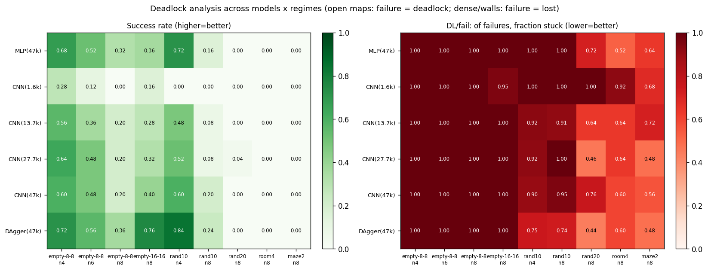
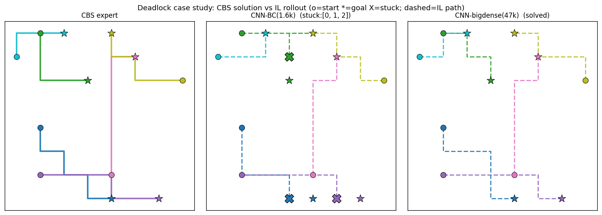
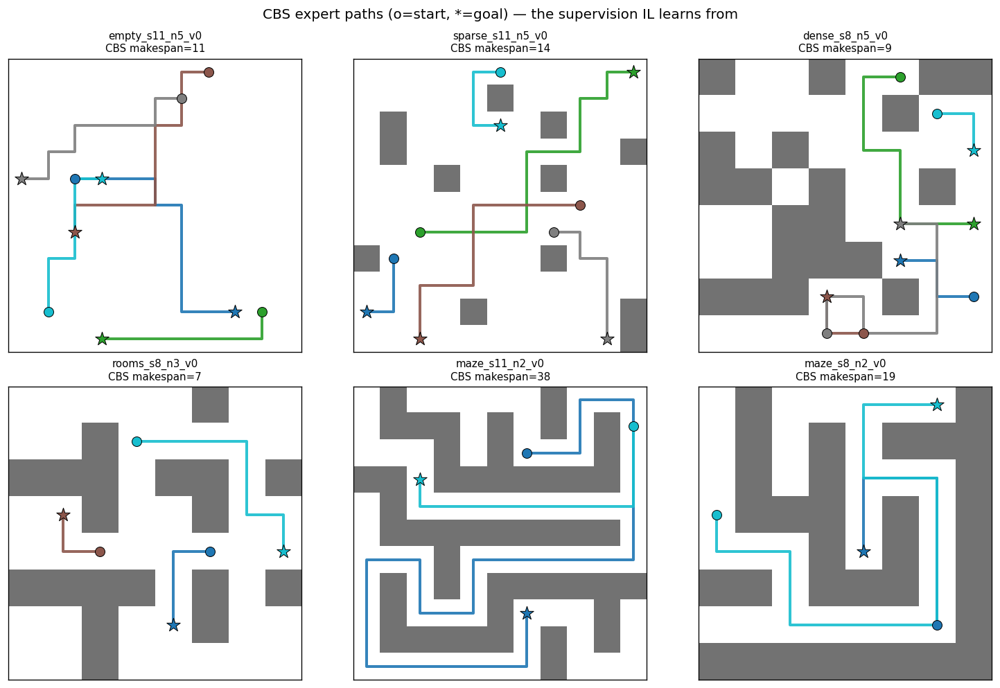

# 데이터 스케일링 × 교착 분석 — CBS vs IL

**질문**: CBS(전문가)로 만든 데이터를 늘려가며 IL 정책을 학습했다. (1) 데이터를 늘리면
성능이 어떻게 변하나? (2) 평가 맵에서 **교착이 어디서 생기고**, 각 방식이 그걸 **어떻게
푸(는데 실패하)나**? CBS와는 어떻게 다른가?

- 비교: **CBS** (전문가/천장) + **IL 6종** — CNN을 데이터 규모별 4점으로, MLP·DAgger는 최종 데이터(47k)로 통일.
- 평가: MovingAI 표준 맵, 인스턴스 스윕. 재현 스크립트는 문서 하단.

## 비교 모델

| 계열 | 모델 | 데이터 | 한 줄 |
|---|---|---|---|
| CBS | 솔버 | — | 최적. 쉬우면 완벽, 어려우면 timeout |
| MLP | `mlp_final` | 47k | 구조 기준선 (flatten → 공간구조 손실) |
| CNN | `cnn` | 1.6k | 스케일링 시작 |
| CNN | `cnn_diverse` | 13.7k | +다양성 |
| CNN | `cnn_big` | 27.7k | +대형맵 |
| CNN | `cnn_bigdense` | 47k | +혼잡 (BC 최종) |
| DAgger | `cnn_dagger_final` | 47k+롤아웃 | 교착 회복 |

---

## 결과 1 — 데이터 스케일링이 성공률/교착에 미친 효과

**성공률** (25 인스턴스/셀). `e8`=empty-8-8, `e16`=empty-16-16, `r10/r20`=random-32-32-10/20.

| 모델 | e8·n4 | e8·n8 | e16·n8 | r10·n4 | r10·n8 | r20·n8 | room·n8 | maze·n8 |
|---|---|---|---|---|---|---|---|---|
| MLP(47k) | 0.68 | 0.32 | 0.36 | 0.72 | 0.16 | 0.00 | 0.00 | 0.00 |
| CNN(1.6k) | 0.28 | 0.00 | 0.16 | 0.00 | 0.00 | 0.00 | 0.00 | 0.00 |
| CNN(13.7k) | 0.56 | 0.20 | 0.28 | 0.48 | 0.08 | 0.00 | 0.00 | 0.00 |
| CNN(27.7k) | 0.64 | 0.20 | 0.32 | 0.52 | 0.08 | 0.04 | 0.00 | 0.00 |
| CNN(47k) | 0.60 | 0.20 | 0.40 | 0.60 | 0.20 | 0.00 | 0.00 | 0.00 |
| **DAgger(47k)** | **0.72** | **0.36** | **0.76** | **0.84** | **0.24** | 0.00 | 0.00 | 0.00 |

**교착률 / DL·fair**(=실패 중 교착 비율). 개방맵은 DL·fair≈1.0(실패=막힘), 벽맵은 낮음(실패=길잃음).

| 모델 | e8·n4 | r10·n4 | r10·n8 | r20·n8 | room·n8 | maze·n8 |
|---|---|---|---|---|---|---|
| CNN(1.6k) | 0.72/1.0 | 1.00/1.0 | 1.00/1.0 | 1.00/1.0 | 0.92/0.92 | 0.68/0.68 |
| CNN(47k) | 0.40/1.0 | 0.36/0.90 | 0.76/0.95 | 0.76/0.76 | 0.60/0.60 | 0.56/0.56 |
| **DAgger(47k)** | **0.28**/1.0 | **0.12**/0.75 | **0.56**/0.74 | 0.44/0.44 | 0.60/0.60 | 0.48/0.48 |

**읽는 법**: 스케일링 곡선(CNN 1.6k→47k)에서 성공률이 오르고 교착률이 내려간다. 특히
**1.6k→13.7k가 큰 도약**(e8·n4 0.28→0.56, r10·n4 0.00→0.48), 이후는 맵 의존적 증분.
`DAgger(47k)`가 데이터로도 안 되던 교착을 추가로 풀어 **전 개방·저밀도 구간 최강**.

## 결과 2 — 교착은 "어떤 종류"인가 (협조 vs 내비게이션)

교착에 빠진 에이전트가 목표 직선방향에서 **벽을 마주보면(NAV)** 우회가 필요한 내비게이션
한계 — 데이터로 못 고치는, `goal_dir`가 우회를 표현 못 하는 문제. 그 외(로봇에 막힘/진동)는
**협조(COORD)** — 데이터·DAgger가 다룰 수 있는 것. (교착 에피소드의 stuck 에이전트 기준, NAV/COORD 비율)

| 모델 | empty-8-8 | r10 | r20 | room | maze |
|---|---|---|---|---|---|
| MLP(47k) | 0.00/1.00 | 0.30/0.70 | 0.71/0.29 | 0.69/0.31 | 0.80/0.20 |
| CNN(1.6k) | 0.00/1.00 | 0.63/0.37 | 0.69/0.31 | 0.77/0.23 | 0.66/0.34 |
| CNN(13.7k) | 0.00/1.00 | 0.71/0.29 | 0.63/0.37 | 0.64/0.36 | 0.65/0.35 |
| CNN(27.7k) | 0.00/1.00 | 0.36/0.64 | 0.54/0.46 | 0.45/0.55 | 0.69/0.31 |
| CNN(47k) | 0.00/1.00 | 0.37/0.63 | 0.68/0.32 | 0.60/0.40 | 0.84/0.16 |
| DAgger(47k) | 0.00/1.00 | 0.21/0.79 | 0.66/0.34 | 0.56/0.44 | 0.62/0.38 |

- **empty-8-8: NAV=0.00** — 벽이 없으니 교착은 100% 협조/진동. 데이터·DAgger가 실제로 stuck 수를 줄임.
- **벽이 늘수록 NAV↑** — r20/room/maze는 NAV 0.54~0.84. 목표 직선방향이 벽을 가리켜 우회가 필요한
  구간. `goal_dir`(직선 벡터)로는 표현 못 하는 **내비게이션 한계** — 데이터로 안 고쳐짐.

## 결과 3 — CBS vs IL 정면 (성공률 / 실행시간)

같은 인스턴스를 CBS와 IL로 각각 풀었다 (10 인스턴스/셀, CBS timeout 8s). 셀 = **성공률 / 평균 시간**.

| 모델 | e8·n2 | e8·n8 | r10·n8 | r20·n8 | maze·n8 |
|---|---|---|---|---|---|
| **CBS** | 1.00 / 0.08s | 1.00 / 0.12s | 1.00 / 0.82s | 1.00 / 1.30s | **0.00 / 8.0s(TO)** |
| MLP(47k) | 1.00 / .004s | 0.30 | 0.20 | 0.00 | 0.00 |
| CNN(1.6k) | 0.60 / .05s | 0.00 | 0.00 | 0.00 | 0.00 |
| CNN(47k) | 1.00 / .005s | 0.20 | 0.00 | 0.00 | 0.00 |
| DAgger(47k) | 1.00 / .004s | 0.40 | 0.30 | 0.00 | 0.00 |

- **IL은 CBS보다 16~250배 빠르다** (0.004~0.5s vs 0.08~1.3s). 쉬운 구간(e8·n2)에선 **품질도 동일**
  (makespan 6.3 일치).
- **CBS는 혼잡에 훨씬 강건** — random-32-32-20 n8까지 성공률 1.00 유지(IL은 0.00). 대신 어려울수록
  시간이 늘어난다.
- **maze·n8: CBS도 timeout(0.00, 8s 낭비)** — 전문가조차 못 푸는 구간 → **라벨 부재 → IL도 학습 불가**.
  둘 다 실패하지만 IL은 0.45s에 즉시 실패, CBS는 8s를 태운다.
- 성공한 IL 해의 makespan은 CBS와 거의 같다(r10·n8: IL 38 vs CBS 39.5) — **되면 거의 최적**.

→ **강점 구간이 갈린다**: IL은 항상 빠르고 쉬운 구간은 CBS급, CBS는 혼잡에 강건하나 어려우면 시간 폭발.

---

## 교착이 어디서 나고 어떻게 갈리나 (케이스)

**협조 교착 — 데이터가 푼다.** empty-8-8, 6 에이전트. CNN(1.6k)은 세 에이전트가 서로 막혀
교착(X)에 빠지지만, 데이터를 늘린 CNN(47k)은 CBS처럼 전원 목표 도달.

**전문가 라벨 = CBS 경로.** 정책이 흉내내는 정답. maze의 긴 우회(makespan 38)를 보면,
직선 `goal_dir`만으로는 이 경로를 배울 수 없음이 분명하다.

---

## 결론 (스토리)

1. **데이터를 늘리면 교착이 줄고 성공률이 오른다** — CNN 1.6k→47k. **1.6k→13.7k(다양성)가 가장 큰
   도약**, 이후 대형맵·혼잡 보강은 해당 구간을 겨냥해 증분 개선(맵 의존적). 단 개방맵에선 혼잡 데이터가
   살짝 트레이드오프(CNN 47k가 27.7k보다 일부 개방셀서 소폭↓, 대신 r10·n8 0.08→0.20).
2. **DAgger(47k)가 데이터 너머의 교착을 푼다** — 전 개방·저밀도 구간 최강(e16·n8 0.40→0.76, r10·n4
   0.60→0.84). held-out acc는 오히려 하락(0.815→0.762)했지만 성공률은 급등 → **DAgger는 성공률/교착으로
   판정해야지 held-out acc로 고르면 안 됨**(지표 불일치 재확인).
3. **MLP(47k)가 의외로 선전** — 1.6k에서 전멸하던 MLP가 47k에선 CNN 중간급(e8·n4 0.68). 데이터가
   충분하면 구조 격차가 좁혀진다. 그래도 어려운 구간·교착 회복은 CNN/DAgger 우위.
4. **교착의 성격이 맵에 따라 갈린다** — 개방맵=협조(데이터·DAgger가 해결), 벽맵=내비게이션(벽 마주봄,
   NAV 0.6~0.84). 후자는 `goal_dir`가 우회를 표현 못 하는 **표현의 한계**.
5. **미해결 = room/maze** — 전 모델 성공률 0. **CBS도 이 구간은 타임아웃**해 라벨 자체가 없다(전문가
   부재). 데이터·DAgger로 못 넘는 벽 → **상태 표현 변경(전역 경로 힌트)** 이 다음 방향.

한 줄: **데이터 스케일링과 DAgger는 "협조 교착"을 지운다. 남은 벽(내비게이션 한계)은 데이터가 아니라
표현의 문제다.**

## 재현

| 스크립트 | 산출 |
|---|---|
| `scripts/eval_deadlock.py --maps ... --out deadlock_final.json` | 성공률/교착률/DL·fail |
| `scripts/eval_deadlock_types.py --out deadlock_types.json` | 교착 유형(협조/내비) |
| `scripts/eval_cbs_vs_il.py --configs ...` | CBS vs IL 성공률/시간 |
| `scripts/plot_report_figures.py --deadlock` | 교착 히트맵 |
| `scripts/plot_paths.py --mode {expert,case}` | CBS/IL 경로·케이스 |
